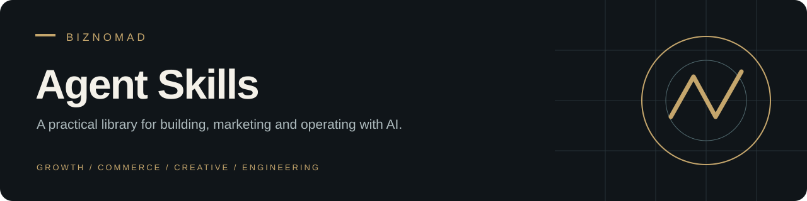

<p align="center"><strong>Reusable workflows. Clear inputs. Useful outputs.</strong></p>
<p align="center"><a href="#start-with-an-outcome">Explore</a> · <a href="#install-one-skill">Install</a> · <a href="growth-evidence-and-reactivation/SKILL.md">Featured skill</a> · <a href="SANITIZATION.md">Sanitization scope</a></p>

A curated library of skills for Claude Code and compatible agent harnesses, spanning paid media, search, commerce, design, video and infrastructure. Choose a workflow, supply your business context, and review its instructions before execution.

## Start with an outcome

| You want to… | Start here |
| :--- | :--- |
| Plan acquisition and bring past customers back | [Growth Evidence & Reactivation](growth-evidence-and-reactivation/SKILL.md) |
| Audit paid advertising | [Ads Audit](ads-audit/SKILL.md) |
| Improve a Shopify store's conversion journey | [Shopify CRO Audit](Biznomad-shopify-cro-audit/SKILL.md) |
| Work on organic search visibility | [SEO](seo/SKILL.md) |
| Build a polished web interface | [Frontend Design](frontend-design-pro/SKILL.md) |
| Create programmatic video | [Remotion Video Production](remotion-video-production/SKILL.md) |
| Work with Cloudflare infrastructure | [Cloudflare](cloudflare/SKILL.md) |

## Featured: Growth Evidence & Reactivation

Turn disconnected business reports into a usable acquisition and customer win-back plan. The skill adapts to ecommerce, services and subscriptions.

**Reconcile evidence → understand margins → plan acquisition → prepare reactivation.**

It produces a source-backed scorecard, discrepancy log, campaign recommendations, eligible customer segments, message drafts and a prioritized roadmap. It can also prepare one consolidated data request for your existing agents. Analysis and drafts are the default; live changes require authorization.

```text
/growth-evidence-and-reactivation Build an acquisition and customer reactivation package for [business], prioritizing [offer], in [market/language].
```

## Install one skill

Start with the skill you need. The examples below install the featured workflow into Claude Code.

**macOS / Linux / Git Bash**

```bash
git clone https://github.com/Biznomad/agent-skills.git
mkdir -p ~/.claude/skills
cp -R agent-skills/growth-evidence-and-reactivation ~/.claude/skills/
```

**Windows PowerShell**

```powershell
git clone https://github.com/Biznomad/agent-skills.git
New-Item -ItemType Directory -Force "$HOME/.claude/skills" | Out-Null
Copy-Item -Recurse ./agent-skills/growth-evidence-and-reactivation "$HOME/.claude/skills/"
```

Review an existing installation before replacing it. Skills may need their own tools, dependencies or account connections; read the selected skill before running it.

## Inside a skill

```text
skill-name/
├── SKILL.md       # Purpose, triggers and workflow
├── references/    # Detailed guidance, loaded when relevant
├── scripts/       # Optional executable helpers
└── assets/        # Optional output resources
```

Each skill is independently inspectable. Some also include agent-specific interface metadata.

## Which Biznomad repository?

| Library | Role |
| :--- | :--- |
| **Agent Skills — this repository** | Curated, shareable workflows for Claude Code and compatible harnesses. |
| [Claude Skills](https://github.com/Biznomad/claude-skills) | Personal Claude Code collection, including snapshots from a local shared skill store. |

These are separate repositories; changes do not synchronize automatically.

## Credentials and provenance

Supply credentials outside this repository. Configurable examples do not establish that every historical revision is free of sensitive material. Read the [sanitization scope and history limitations](SANITIZATION.md). Review scripts and permissions before use.

## License

[MIT](LICENSE). No warranty. Review each workflow and its dependencies for your intended use.
