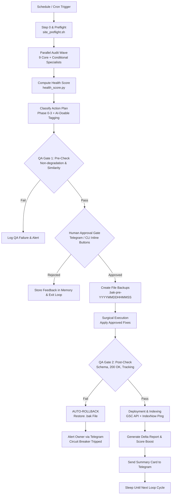

# Autonomous SEO/GEO/AEO Engine: Loop Graph & Human-in-the-Loop Gate Architecture

## 1. Autonomous Loop Graph (Mermaid)

---

## 2. 5-Stage Autonomous Execution Protocol

### Stage 1: Trigger & Preflight
- **Interval**: Weekly or Event-Driven (Git Push / Deploy).
- **Execution**: `scripts/site_preflight.sh <domain>`.
- **Outputs**: `preflight.txt` (HTTP codes, SSL, AI crawler accessibility, `llms.txt` presence, sitemap counts).

### Stage 2: Concurrent Specialist Audit & Scoring
- Specialist agents (`seo-technical`, `seo-schema`, `seo-geo`, `seo-local`, `seo-content`, `seo-performance`, `seo-sxo`, `seo-visual`, `seo-sitemap`) run in parallel.
- Score merged into `audit-data.json` via `scripts/health_score.py`.

### Stage 3: QA Gate 1 (Pre-Execution Inspection)
- **Check 1**: Page Similarity check (`scripts/page_similarity.py < threshold`).
- **Check 2**: Owner Directives check (e.g. "Do not touch hero video animation").
- **Check 3**: Syntax & Linting pre-check for Liquid/HTML/JSON-LD.

### Stage 4: Human Approval Gate (Telegram / CLI)
- **Channel**: Telegram Business Bot or CLI Prompt.
- **Message Content**: Proposed batch items, total score impact projection, risk assessment.
- **Buttons**:
  - `[Approve Phase 0 (Trust & Safety)]`
  - `[Approve All AI-Doable Fixes]`
  - `[Reject Batch / Request Modifications]`

### Stage 5: Gated Fix, QA Gate 2, & Auto-Rollback
- **Pre-Fix**: Write timestamped `.bak-pre-<slug>-<YYYYMMDDHHMMSS>` files.
- **Fix Execution**: Apply changes surgical edit by edit.
- **Post-Fix Verification**:
  - Valid JSON-LD schema parsing (Google Structured Data API / local validator).
  - HTTP 200 response check.
  - Tracking pixels & DNI lines verified intact.
- **Fail Action**: Instant automatic rollback from `.bak-pre-` backup on any test failure.

---

## 3. Circuit Breaker Rules

1. **Max Auto-Rollbacks**: If 2 consecutive fixes trigger rollbacks, freeze the engine and alert human.
2. **Shopify Guardrail**: Never touch live themes directly; edits execute on unpublished dev theme until human approves live push.
3. **Tracking Safety**: If Google Tag Manager or DNI tracking line is altered/broken, immediate emergency rollback.
